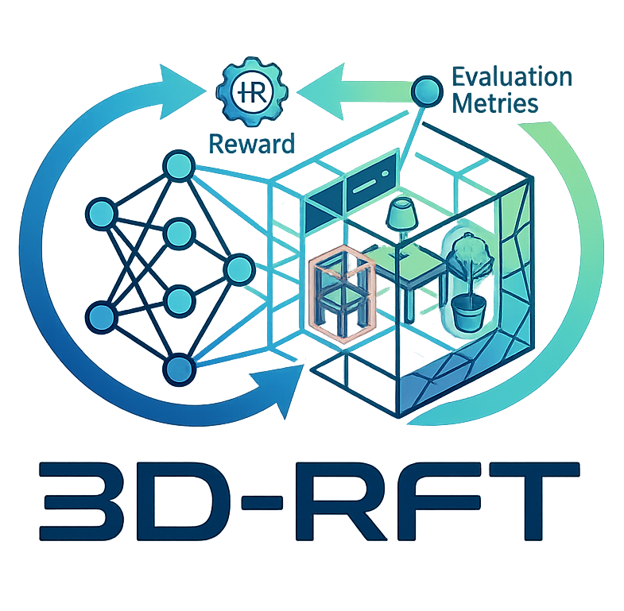

<h2 align="center">
  <span></span><b>3D-RFT: Reinforcement Fine-Tuning for Video-based 3D Scene Understanding</b>
</h2>

<h3 align="center">
ICML 2026
</h3>

<div align="center" margin-bottom="6em">
<a target="_blank" rel="external nofollow noopener" href="https://xiongkunlinghu.github.io/">Xiongkun Linghu*</a>,
<a target="_blank" rel="external nofollow noopener" href="https://huangjy-pku.github.io/">Jiangyong Huang*</a>,
<a target="_blank" rel="external nofollow noopener" href="https://buzz-beater.github.io/">Baoxiong Jia</a>,
<a target="_blank" rel="external nofollow noopener" href="https://siyuanhuang.com/">Siyuan Huang</a>
</div>
&nbsp;

<div align="center">
    <a href="https://arxiv.org/abs/2603.04976" target="_blank" rel="external nofollow noopener">
    </a>
    <a href="https://3d-rft.github.io/" target="_blank" rel="external nofollow noopener">
    </a>
    <a href="" rel="external nofollow noopener" target="_blank">
    </a>
    <a href="https://github.com/3D-RFT/3D-RFT-Reasoning" rel="external nofollow noopener" target="_blank">
    </a>
</div>
&nbsp;


## Codebase
Choose the codebase according to the task family
| Component | Status | Repository |
| --- | --- | --- |
| 3D-RFT Perception | Coming soon | To be announced |
| 3D-RFT Reasoning | Released | [3D-RFT/3D-RFT-Reasoning](https://github.com/3D-RFT/3D-RFT-Reasoning) |


## BibTex
If you find this project useful, please cite our paper:
```bibtex
@inproceedings{linghu20263d,
  title={3D-RFT: Reinforcement Fine-Tuning for Video-based 3D Scene Understanding},
  author={Linghu, Xiongkun and Huang, Jiangyong and Jia, Baoxiong and Huang, Siyuan},
  booktitle={International Conference on Machine Learning},
  year={2026}
}
```
